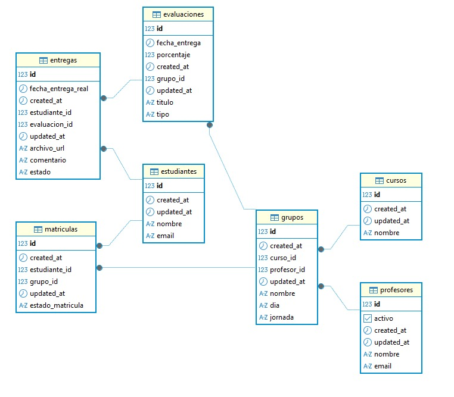

# Cronoclase

**Plataforma para la gestión visual de hitos académicos y seguimientos dinámico del progreso semestral.**

---

## Introducción / Contexto

- **Descripción del problema:** La desarticulación entre el pacto pedagógico y el seguimiento diario genera confusión en los estudiantes sobre los plazos y una carga administrativa excesiva para los docentes al gestionar entregas.
- **Justificación:** Es relevante porque centraliza la planificación educativa en una herramienta visual, mejorando la organización del tiempo, reduciendo el incumplimiento de entregas y permitiendo un control transparente del avance académico.
- **Dominio:** Gestión de procesos educativos y seguimiento de cronogramas académicos.
---
## Objetivos

**Objetivo General**
- Permitir el seguimiento de un periodo académico a través de una línea de tiempo dinámica que se actualice conforme al avance del mismo, facilitando la gestión de hitos, evaluaciones y actividades para optimizar la planificación y el seguimiento del proceso educativo.

---

**Objetivos Específicos** 

- **OE1:** Implementar una línea de tiempo interactiva que refleje el progreso del semestre, permitiendo la definición y visualización de hitos clave.
- **OE2:** Diseñar un sistema de gestión de actividades que permita a los docentes asignar tareas y a los estudiantes realizar entregas dentro de los plazos.
- **OE3:** Integrar funcionalidades de notificación para alertar a los usuarios sobre evaluaciones y cierres de actividades próximos.
- **OE4:** Desarrollar un módulo de manejo de archivos para permitir la carga y descarga eficiente de documentos académicos.

---
## Alcance del Proyecto (Scope)

**Qué se va a desarrollar:** - 
- Módulo de gestión de hitos (creación, edición y visualización).
- Sistema de carga de tareas y gestión de archivos adjuntos.
- Panel de notificaciones para fechas críticas.
- Autenticación y perfiles diferenciados (Docente / Estudiante).

**Qué NO se va a desarrollar en esta versión (fuera de alcance):** 

- Integración con Google Calendar o plataformas externas de calendario.
- Calificación automática de cuestionarios.
- Generación de certificados finales en PDF.

## Tecnologías y Herramientas (Tech Stack)

- **Backend**: Spring Boot 3.x, Java 17/21, Spring Data JPA.
- **Frontend**: React, javaScript (es6+),bootstrap
- **Base de datos**: PostgreSQL para producción y H2 para desarrollo local.
- **Otras herramientas**: Lombok, Spring Boot DevTools, Git, GitHub, Postman, Swagger, Docker.

**Dependencias obligatorias del proyecto (Backend):**

| Dependencia | Versión | Descripción |
| :--- | :--- | :--- |
| `spring-boot-starter-web` | 3.4.2 | API REST con Spring MVC |
| `spring-boot-starter-data-jpa` | 3.4.2 | ORM con Hibernate / Spring Data JPA |
| `lombok` | managed | Reducción de boilerplate (getters, setters, constructores) |
| `spring-boot-devtools` | 3.4.2 | Recarga automática en desarrollo |
| `h2` | runtime | Base de datos en memoria para pruebas locales |
| `postgresql` | runtime | Driver JDBC para PostgreSQL en producción |

> ⚠️ **Nota importante:** Este proyecto utiliza **Spring Data JPA** como ORM. Prisma es un ORM exclusivo del ecosistema Node.js y **no es compatible** con Spring Boot/Hibernate. Toda la gestión de datos se realiza a través de Spring Data JPA.

## Integrantes del Equipo

| Nombre                  | Rol principal              | Usuario GitHub     |
|-------------------------|----------------------------|--------------------|
| Irwin Colmenarez              | Líder / Frontend           | @Irwincol         |
| Paula  Gil              | Líder / Backend         | @GGP113         |
| Carlos Martínez              | Desarrollador Frontend            | @CMARTINEZ-95         |
| Estiben Manco              | Desarrollador Backend           | @Estibenmanco31         |
| Víctor Alejandro Berrío              | Desarrollador DB        | @Vastrocode72        |
| Sebastián Hernández             | Desarrollador Frontend        | @Sebas-1013         |

## Diagrama de Clases del Dominio (v1)


El diagrama de dominio muestra las entidades principales del sistema (por ejemplo, Usuario, Docente, Estudiante, Actividad, Hito, Entrega) y las relaciones entre ellas. Es una vista conceptual que ayuda a entender el modelo antes de entrar a la implementacion tecnica.


## Instrucciones de Instalación y Ejecución para desarrolladores

### Requisitos Previos
1. Asegúrate de tener instalado Java 17 o superior.
2. Instala Maven si no está incluido en tu entorno.
3.Configura una base de datos compatible (H2 o PostgreSQL).

### Pasos para la Instalación
1. Clona este repositorio en tu máquina local:
   ```bash
   git clone [https://github.com/irwincol/cronoclase-grupo-5.git]
   ```
2. Navega al directorio del proyecto:
   ```bash
   cd cronoclase-grupo-5
   ```

### Configuración de la Base de Datos
- **H2 (Base de datos en memoria para desarrollo):**
  Crea un archivo `application-dev.properties` en el directorio `src/main/resources/` con el siguiente contenido:
  ```properties
  spring.datasource.url=jdbc:h2:mem:testdb
  spring.datasource.driverClassName=org.h2.Driver
  spring.datasource.username=sa
  spring.datasource.password=password
  spring.jpa.database-platform=org.hibernate.dialect.H2Dialect
  ```

- **PostgreSQL (Base de datos para producción):**
  Crea un archivo `application-dev.properties` en el directorio `src/main/resources/` con el siguiente contenido:
  ```properties
  spring.datasource.url=jdbc:postgresql://localhost:5432/cronoclase
  spring.datasource.driverClassName=org.postgresql.Driver
  spring.datasource.username=postgres
  spring.datasource.password=tu-contraseña
  spring.jpa.database-platform=org.hibernate.dialect.PostgreSQLDialect
  ```

### Ejecución de la Aplicación
- Desde la línea de comandos:
  ```bash
  ./mvnw spring-boot:run
  ```
- Desde un IDE:
  1. Importa el proyecto como un proyecto Maven.
  2. Ejecuta la clase `CronoclaseGrupo5Application` como una aplicación Java.

### Notas Adicionales
- Asegúrate de que el puerto configurado en `application.properties` no esté en uso.
- Para cambiar el perfil de ejecución, utiliza la variable de entorno `SPRING_PROFILES_ACTIVE` (por ejemplo, `dev` o `prod`).
